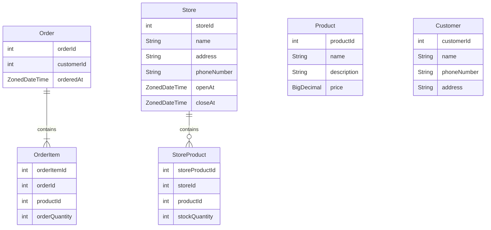

# TEST

## 요구사항

- 특정 매장으로부터 상품을 주문할 수 있다.
- 주문을 할 땐 최소 하나 이상의 상품을 골라야 한다.
- 재고가 없다면 주문할 수 없다.
- 참고: https://newedge.tistory.com/173
    - 스타벅스 사이렌 오더

## 도메인

### 주문 (Order)

- 사용자는 원하는 수량만큼 상품을 주문할 수 있다.
- 주문을 할 땐, 특정 매장을 지정해야 한다. (재고)
- 하나 이상의 상품을 주문할 때, 주문을 만들 수 있다.

### 고객 (Customer)

- 주문을 하기 위해서는 미리 회원가입이 되어 있어야 한다.
- 회원은 이름, 주소, 전화번호가 필요하다.

### 매장 (Store)

- 매장을 등록할 수 있다.
- 매장은 이름, 주소, 전화번호, 오픈-종료 시간이 필요하다.

### 상품 (Product)

- 상품을 등록할 수 있다.
- 상품은 이름, 설명, 그리고 가격을 등록해야 한다.

### 매장 별 상품

- 각 매장에는 판매할 수 있는 재고가 정해져있음
- 재고를 업데이트할 수 있어야 한다.
- 매장은 주문이 들어오면 매장에서 제공할 수 있는 재고가 존재하는지 확인한다.
    - 만약 주문 내 하나의 상품이라도 품절인 경우에는 주문을 취소한다.
    - 주문이 성공하면 매장 내 재고 개수를 조정한다.

## ERD



## Local MySQL

```
# mysql image 가져오기
$ docker pull mysql

# docker run
$ docker run --name localmysql -e MYSQL_ROOT_PASSWORD=coffee -p 3306:3306 -d mysql:latest
```


### 참고할 github
https://github.com/kdohyeon/order-system-toy

### 넷플릭스 모작 github(모듈로 나눠서 동작 )
https://github.com/kdohyeon/fcss-project

### data.sql 과 schema.sql 을 먼저 실행후 run 하기

### 요청방식
GET 요청 (@RequestParam) :쿼리 파라미터를 사용하여 데이터를 전달,조회(GET)할 때 사용


POST 요청 :
1. @RequestParam + x-www-form-urlencoded ,새로 추가할 때 사용하며, 요청 본문(body)에 데이터를 포함
2. @RequestBody + JSON :JSON 데이터를 body에 담아서 보내려면 @RequestBody를 사용


PUT 요청 (수정): 기존 데이터를 수정할 때 사용,@RequestBody를 사용하여 JSON 데이터로 받는 것이 일반적


//@RequestParam URL 쿼리 파라미터 또는 x-www-form-urlencoded 형식의 폼 데이터를 처리
// JSON 형식의 데이터를 처리합니다. HTTP 요청 본문에 포함된 JSON 데이터를 Java 객체로 변환하여 사용


### 포진키 걸린 테입블들을 지우는방법  
SET foreign_key_checks = 0; 
//지울려면 이걸먼저 처리해줘야 한다  
//foreign_key 를 걸면 테이블이 다엮여 있기 때문에 그런걸 해지해주기 위해서 설정